# ICE V1.0 — 综合渗透测试工具集

> 一款基于 Windows 桌面端渗透测试工具箱，集成信息收集、武器库、工具箱、编码转换四大类共 18+ 子模块。

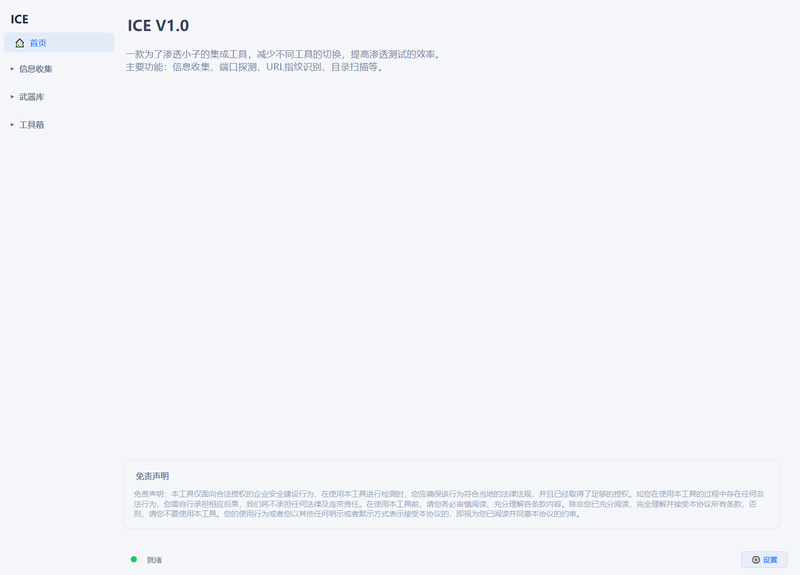

---

## 目录

- [工具介绍](#工具介绍)
- [主要功能](#主要功能)
- [开发目的](#开发目的)
- [功能模块详情](#功能模块详情)
  - [信息收集](#信息收集)
  - [武器库](#武器库)
  - [工具箱](#工具箱)
  - [编码转换](#编码转换)
- [快速开始](#快速开始)
- [更新日志](#更新日志)
- [致谢](#致谢)
- [免责声明](#免责声明)
- [交流](#交流)

---

## 工具介绍

**ICE** 是一款面向渗透测试人员的综合工具集，旨在降低日常安服渗透测试中的工具切换成本。项目完全由 Python 开发。

---

## 主要功能

| 分类 | 模块数 | 核心能力 |
| ---- | ------ | -------- |
| **信息收集** | 6 | 端口扫描、子域名挖掘、目录扫描、JSFinder、指纹识别、权重查询 |
| **武器库** | 6 | JWT破解、IP查询、反弹Shell生成、常用命令、WebShell集合、文件下载 |
| **工具箱** | 4 | 数据处理、社工字典生成、弱密码查询、杀软识别 |
| **编码转换** | 1 (32种方法) | Base系列编解码、对称/非对称加解密、哈希计算 |

---

## 开发目的

1. **个人日常渗透需求**：日常渗透测试中需要使用多个工具，来回切换效率低下。将个人常用功能整合到一个工具箱中，减少工具切换成本。
2. **学习与参考社区**：已有各位大佬的优秀工具箱发布，参考并学习其设计思路，结合个人日常渗透中使用频率较高的模块进行整合，并对部分功能做了个性化改动，增加了一些日常渗透中积累的小 tips。
3. **全 Python 重构**：整个项目完全由个人使用 Python 从零开发重构，作为学习和实践 GUI 编程、网络编程的练手项目。

核心目的还是——**方便自己使用，嘿嘿。**

---

## 功能模块详情

### 信息收集

<details>
<summary><b>端口扫描</b> — 多目标端口探测与服务识别</summary>

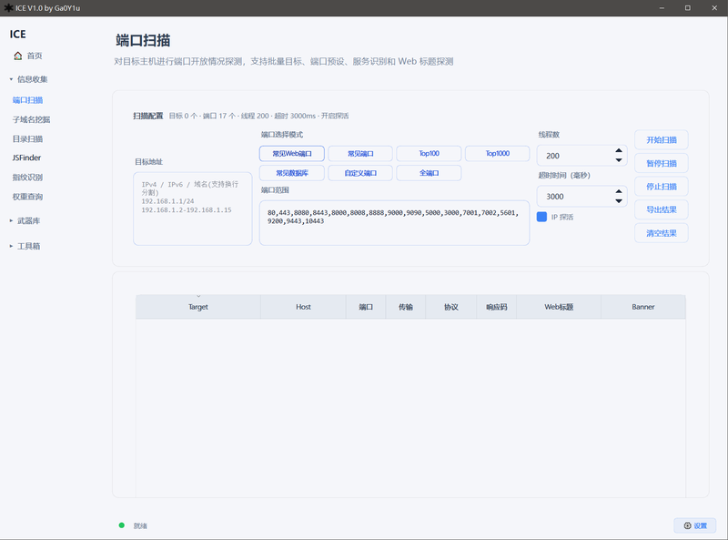

</details>

<details>
<summary><b>子域名挖掘</b> — DNS 字典爆破与解析</summary>

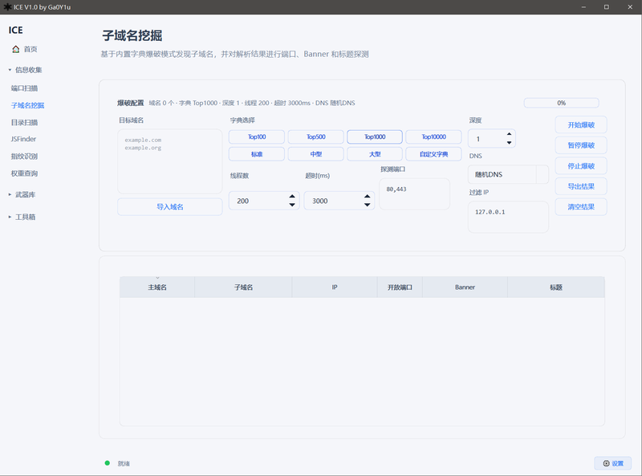

</details>

<details>
<summary><b>目录扫描</b> — Web 路径爆破与绕过 403</summary>

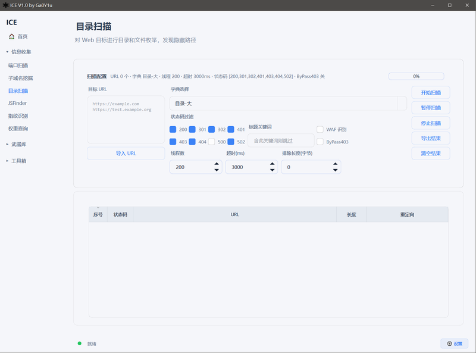

</details>

<details>
<summary><b>JSFinder</b> — JS 文件敏感信息提取</summary>

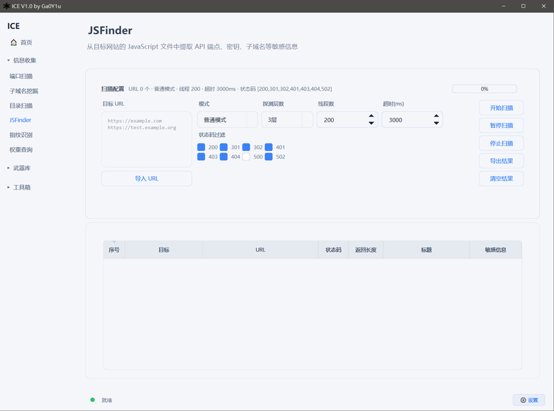

</details>

<details>
<summary><b>指纹识别</b> — CMS / 框架 / 技术栈识别</summary>

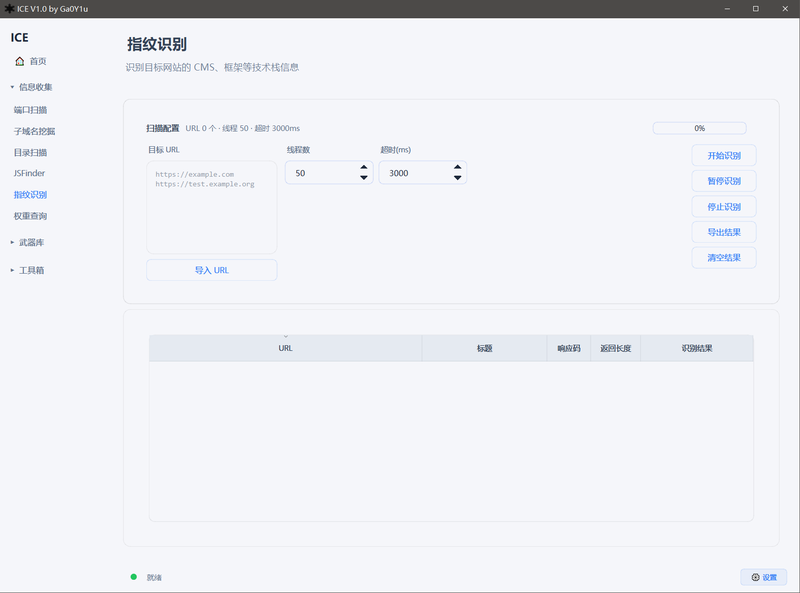

</details>

<details>
<summary><b>权重查询</b> — ICP 备案与 SEO 权重查询</summary>

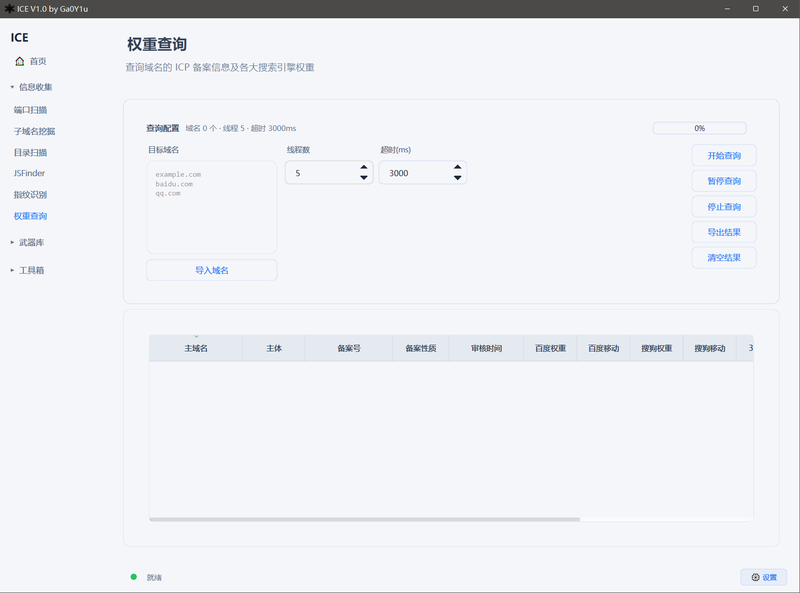

</details>

---

### 武器库

<details>
<summary><b>JWT 破解</b> — JWT Token 全功能工具</summary>

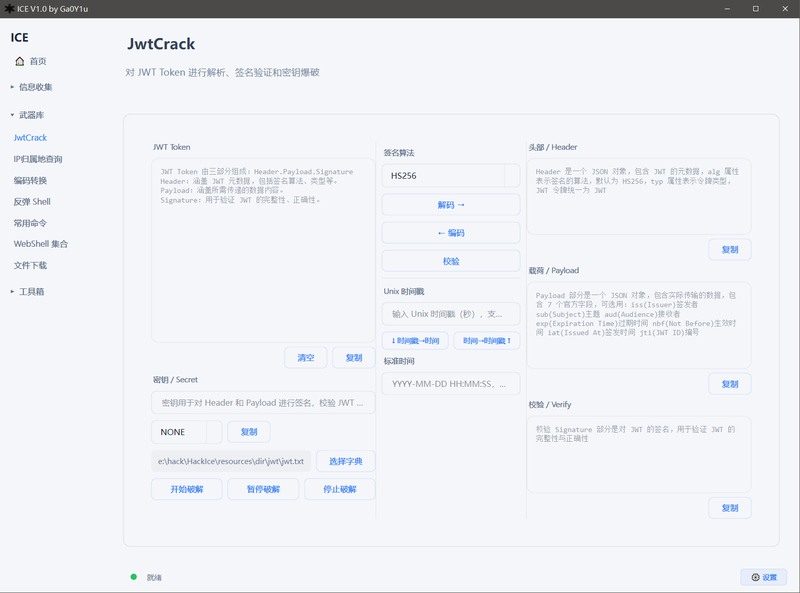

</details>

<details>
<summary><b>IP 归属地查询</b> — 批量 IP 定位</summary>

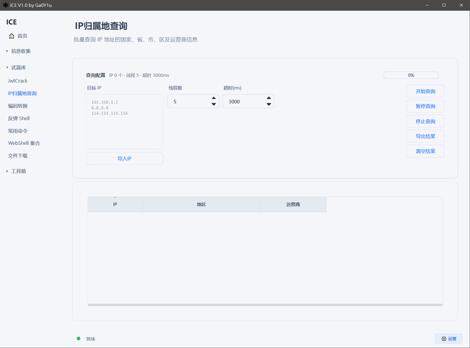

</details>

<details>
<summary><b>反弹 Shell</b> — 多平台反弹 Shell 命令生成器</summary>

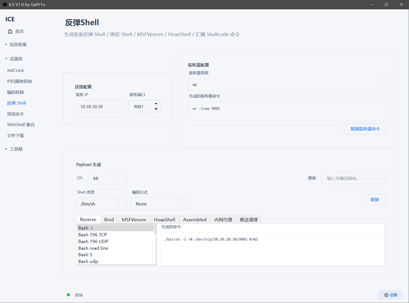

</details>

<details>
<summary><b>常用命令</b> — 渗透测试命令速查</summary>

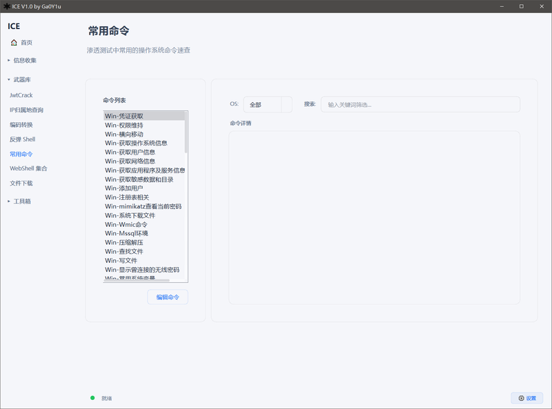

</details>

<details>
<summary><b>WebShell 集合</b> — 多语言 WebShell 速查</summary>

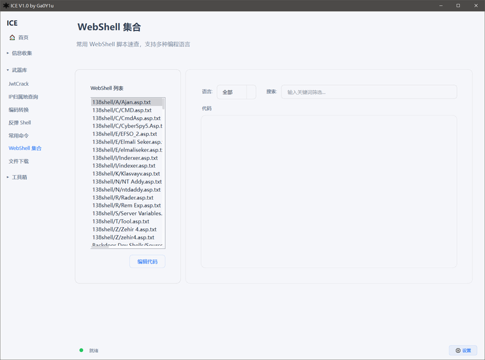

</details>

<details>
<summary><b>文件下载</b> — 跨平台文件传输命令生成器</summary>

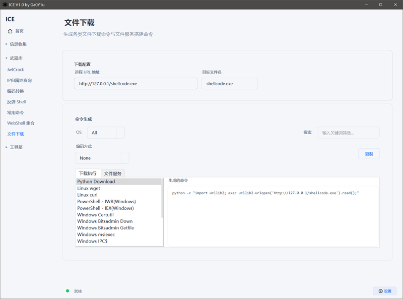

</details>

---

### 工具箱

<details>
<summary><b>数据处理</b> — 25 种按行文本处理操作</summary>

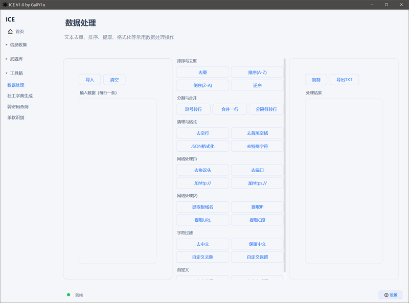

</details>

<details>
<summary><b>社工字典生成</b> — 基于个人信息的密码字典生成</summary>

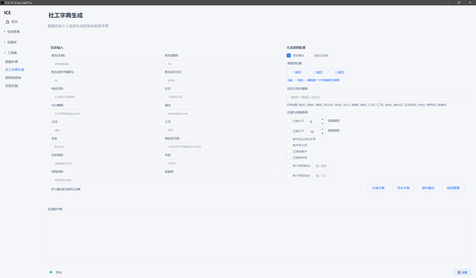

</details>

<details>
<summary><b>弱密码查询</b> — 常见弱密码与设备默认口令</summary>

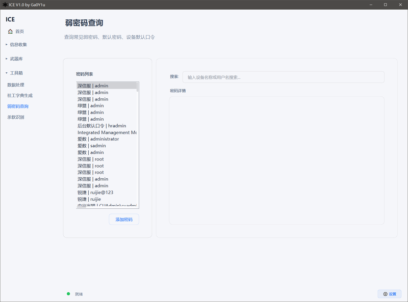

</details>

<details>
<summary><b>杀软识别</b> — 进程列表杀软识别</summary>

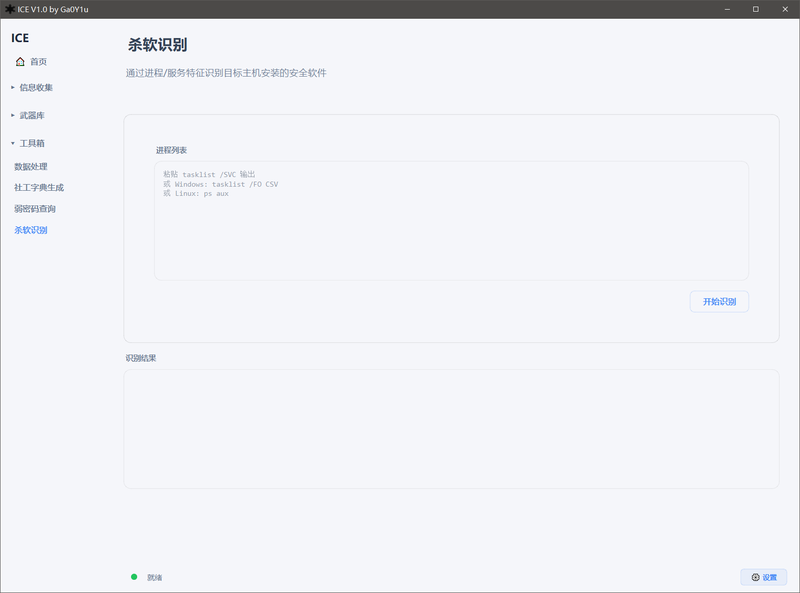

</details>

---

### 编码转换

独立的编码转换模块，支持 **32 种编码/加解密/哈希方法**。

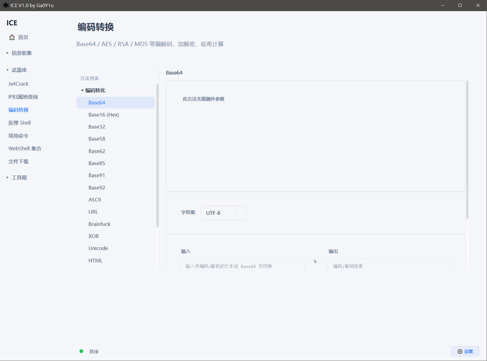

---

## 快速开始

### 环境要求

- Python 3.7+
- Windows 10/11

### 安装与运行

```bash
# 克隆仓库
git clone https://github.com/Ga0Y1u/ICE.git
cd ICE

# 安装依赖
pip install -r requirements.txt

# 运行
python main.py
```

## 更新日志

### V1.0 (2026-05-28) — 初始版本

**信息收集**：

- 端口扫描（多线程，TOP 100/1000/全端口，服务识别）
- 子域名挖掘（多级字典，多 DNS 服务器）
- 目录扫描（多级字典，403 绕过，状态码筛选）
- JSFinder（敏感信息提取，自定义正则）
- 指纹识别（Favicon/Cookie/Header 多维匹配）
- 权重查询（ICP 备案 + 多平台 SEO 权重）

**武器库**：

- JWT 破解（解码/编码/校验/字典破解/时间戳转换）
- IP 归属地批量查询
- 反弹 Shell 命令生成器（多语言/MSFVenom/HoaxShell/汇编Shellcode）
- 常用渗透测试命令速查
- WebShell 脚本集合
- 文件下载命令生成器

**工具箱**：

- 数据处理（25 种文本处理操作）
- 社工字典生成器（15 字段多模式组合）
- 弱密码查询（常见弱密码 + 设备默认口令）
- 杀软识别（进程列表分析）

**编码转换**：

- 16 种编码转化（Base 系列 / URL / Unicode / 摩斯电码 / 进制转换）
- 10 种加解密算法（AES / DES / 3DES / SM4 / RSA / SM2 / XOR / RC4 / Rabbit / HMAC）
- 6 种哈希算法（MD5 / SM3 / SHA1 / SHA2 / SHA3 / NTLM）

---

## 致谢

工具开发过程中参考了以下优秀项目和社区，在此一并感谢：

| 项目 | 说明 |
| ---- | ---- |
| [TscanPlus](https://github.com/TideSec/TscanPlus) | TideSec 团队的综合扫描工具 |
| [mitan](https://github.com/kkbo8005/mitan) | 密探渗透测试工具 |
| [OneForAll](https://github.com/shmilylty/OneForAll) | 功能强大的子域名收集工具 |
| [dirsearch_bypass403](https://github.com/lemonlove7/dirsearch_bypass403) | 目录扫描与 403 绕过 |
| [URLFinder](https://github.com/pingc0y/URLFinder) | JS 敏感信息提取 |
| [EHole](https://github.com/EdgeSecurityTeam/EHole) | 红队重点攻击系统指纹识别 |
| [未闻安全](https://forum.ywhack.com/) | 安全技术交流社区 |
| [渗透师](https://book.shentoushi.top) | 渗透测试学习资源 |
| [Webshell](https://github.com/tennc/webshell) | webshell收集项目 |

> 以上排名不分先后，感谢各位师傅的开源精神与知识分享！

---

## 免责声明

**本工具仅供授权测试与学习研究使用，禁止用于非法用途。**

1. 使用本工具进行渗透测试时，使用者应确保已获得目标系统的合法授权。
2. 使用者应当遵守所在国家/地区的相关法律法规，任何未经授权的安全测试均属违法行为。
3. 若使用者将本工具用于非法目的，所造成的任何后果由使用者本人承担，与开发者无关。
4. 本工具中的反弹 Shell、WebShell 等功能模块仅用于授权渗透测试中的安全评估，请勿在非授权环境中使用。
5. 开发者不对因使用本工具而导致的任何直接或间接损失负责。

**请记住：未知攻，焉知防。学习攻击技术的目的是为了更好地防御。**

---

## 交流

这个项目由个人完全用 Python 开发重构，代码和经验均在持续积累中。若遇到 Bug 或有更好的模块想法，欢迎各位师傅交流沟通：

- **微信**：`bmzgyyyy`
- **Issue**：欢迎在 [GitHub Issues](https://github.com/Ga0Y1u/ICE/issues) 中提出问题和建议

> 添加微信时请备注「ICE」，谢谢！
